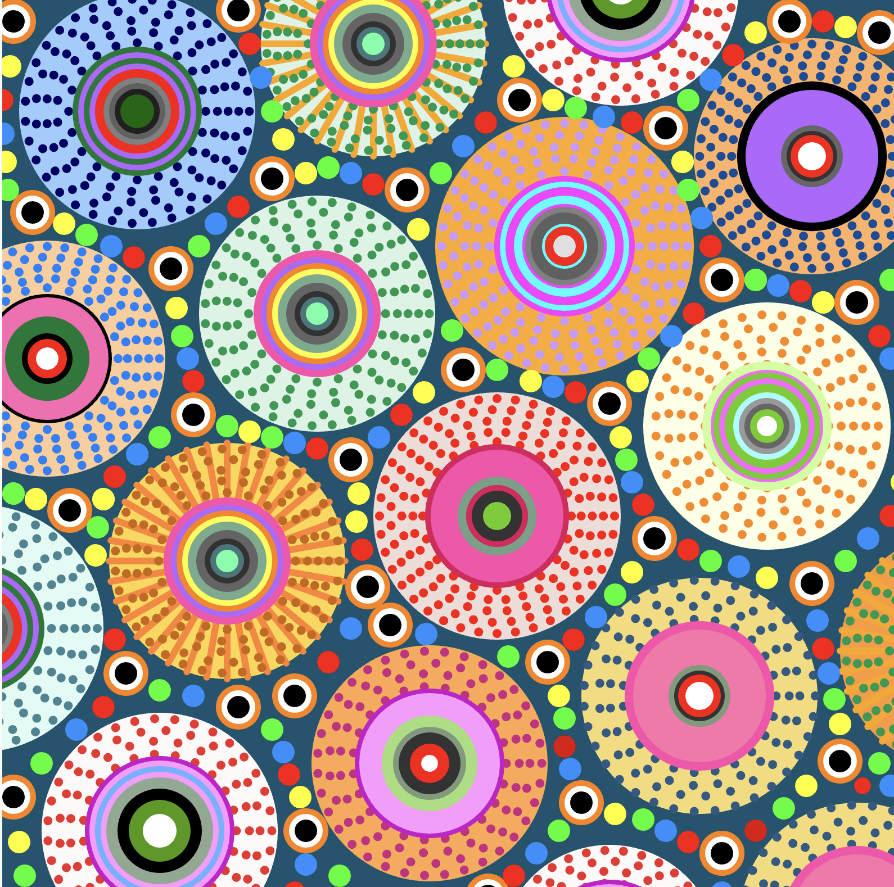
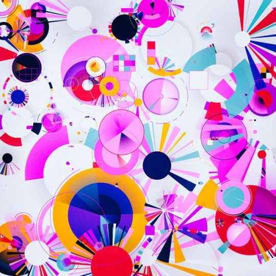
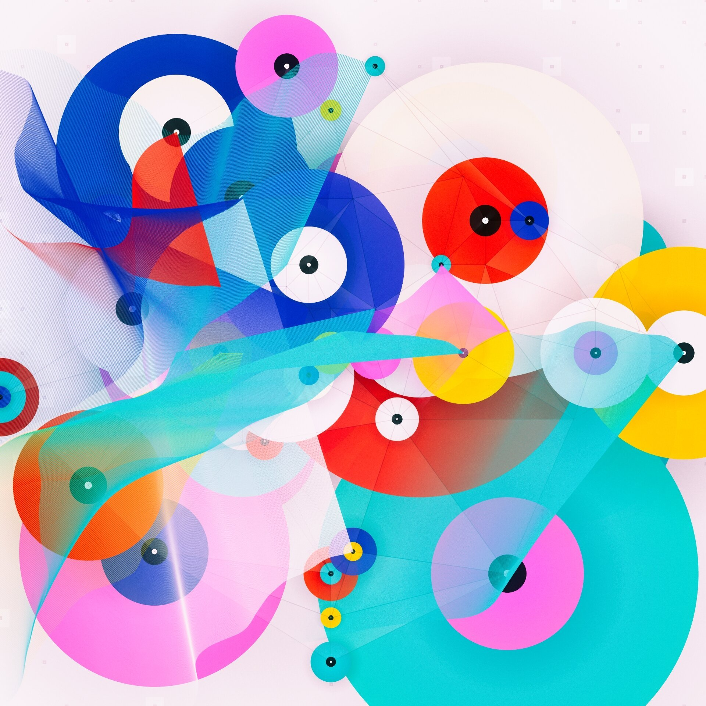

# yche0995_Yuxin-Chen_GroupD
 ## Part 1: Project introduction
 
 
 

>This is the artwork we chose for our big assignment. We used p5.js to reproduce this artwork.

 

 >We use p5.js to restore. We didn't get it 100% right. Like curved lines, which we tried twice without success. And the writing format is not the most concise.
 
##  Part 1.1: How to Interact with the Project
>I chose to use mouse clicks for interactive animation effects.

- When you click on a circle in a work of art, the clicked circle randomly changes color, and all the circles begin to shake
(Rely on x and y axes for movement simulation jitter effect)

- Click again to end the jitter effect.

 ## Part 1.2: Source of inspiration
 

 

  

#### Example 1/2: From Manolo Gamboa Naon 
[Link Text](https://www.behance.net/manoloide
)

## Part 1.3: Source of inspiration
>I mainly added the action effect by clicking on the big circle to change the color and add the shaking effect.

  ### 1.if (circle.shake)
   { 
      circle.x += random(-5, 5);
      circle.y += random(-5, 5); 
    }

    According to 7.4: Mouse Interaction with Objects - p5.js Tutorial learned knowledge. Create a jitter effect by changing the x and y wheelbase separation.

[Link Text](https://www.youtube.com/watch?v=TaN5At5RWH8
)

### 2.redraw() 

     Execute the code inside draw() once. This function allows the program to update the display window only when needed, such as when mousePressed() or keyPressed() events are fired.

 [Link Text](https://p5js.org/zh-Hans/reference/#/p5/redraw
)    

###  3.let d = dist(mouseX, mouseY, circle.x, circle.y)

     The dist function is used to calculate the distance between the mouse and the center of the circle.

 [Link Text](https://p5js.org/zh-Hans/reference/#/p5/dist
)    
### (d < circle.size / 2)
   
    The distance is less than the radius of the circle

###  4.circle.color = color(random(255), random(255), random(255));
 
    Refresh colors randomly. The color is different every time you click. It's random.

 [Link Text](https://p5js.org/zh-Hans/reference/#/p5/random
)    

